---
## Front matter
lang: ru-RU
title: лабораторной работы №1
subtitle: Установка и конфигурация операционной системы на виртуальную машину
author:
  - Кхари Жекка Кализая Арсе

## i18n babel
babel-lang: russian
babel-otherlangs: english

## Formatting pdf
toc: false
toc-title: Содержание
slide_level: 2
aspectratio: 169
section-titles: true
theme: metropolis
header-includes:
 - \metroset{progressbar=frametitle,sectionpage=progressbar,numbering=fraction}
---

# характеристики BM

## название машины

:::::::::::::: {.columns align=center}
::: {.column}
- название машины
- файл .iso 
- расположение машины

:::

::: {.column width="80%"}

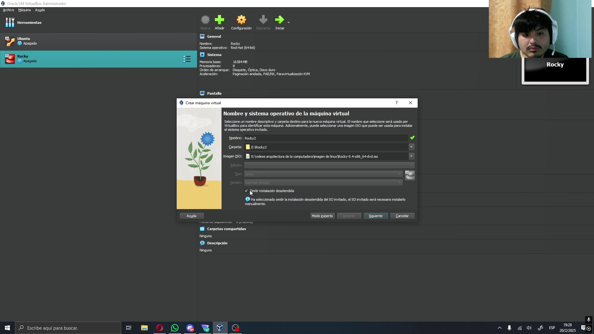

:::
::::::::::::::

## объем памяти и ядра процессора

:::::::::::::: {.columns align=center}
::: {.column}

- 8гб ОП
- 8 ядер процессора

:::

::: {.column width="80%"}

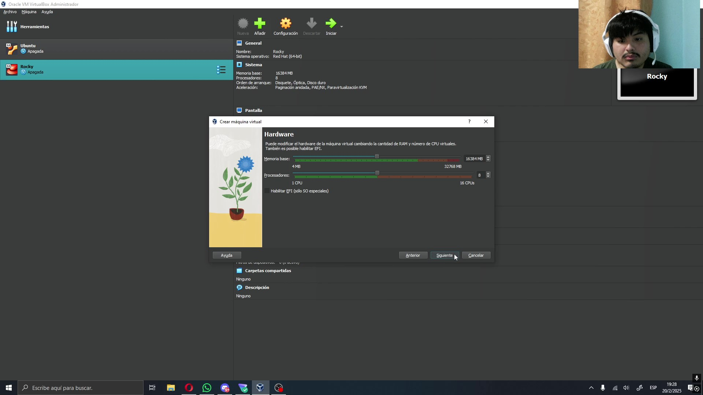

:::
::::::::::::::

## Объем жесткого диска

:::::::::::::: {.columns align=center}
::: {.column}

- 100 гб

:::

::: {.column width="80%"}

:::
::::::::::::::

# Установка ОС

## выбор опции

:::::::::::::: {.columns align=center}
::: {.column}

- начинаем настроику ОС

:::

::: {.column width="80%"}

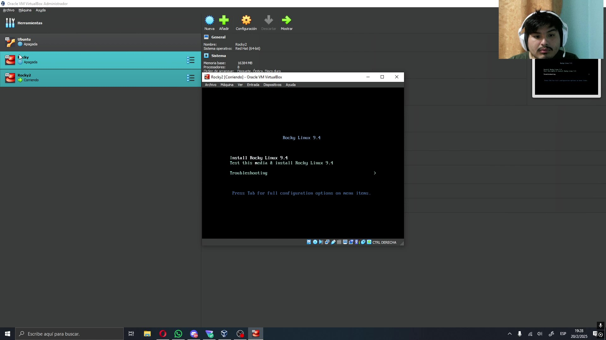

:::
::::::::::::::

## выбор языка

:::::::::::::: {.columns align=center}

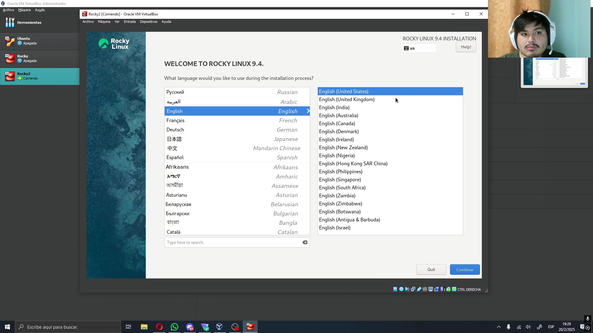

::::::::::::::

## выбор жесткого диска

:::::::::::::: {.columns align=center}

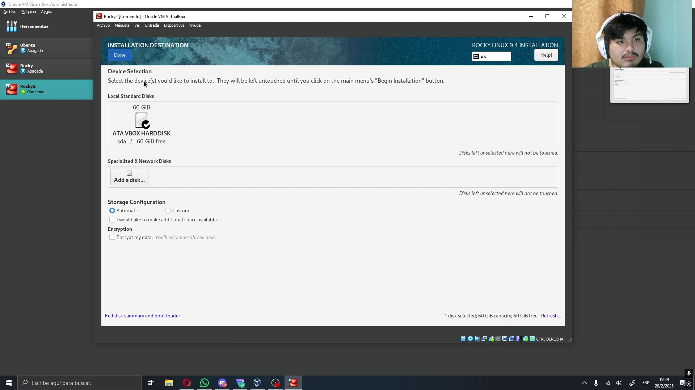

::::::::::::::

## установка программного обеспечения

:::::::::::::: {.columns align=center}

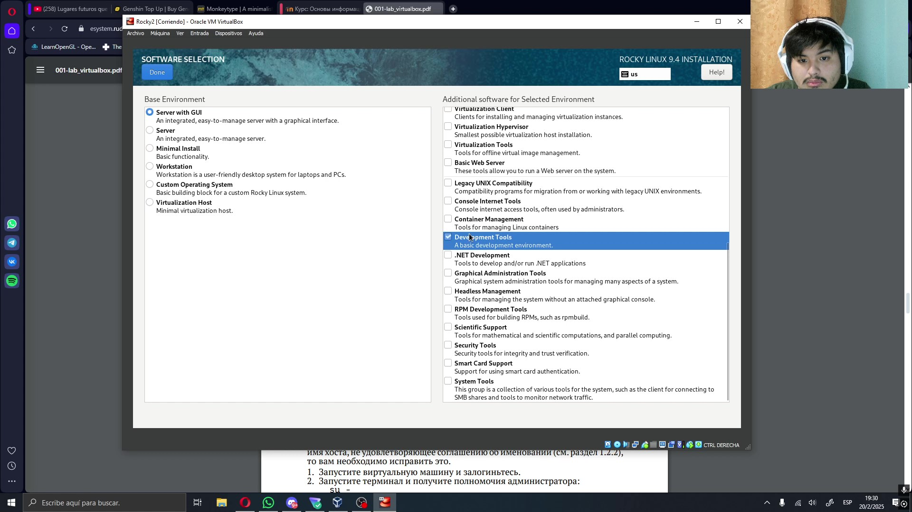

::::::::::::::

## отключение KDUMP

:::::::::::::: {.columns align=center}

::::::::::::::

## изменение названия хоста

:::::::::::::: {.columns align=center}

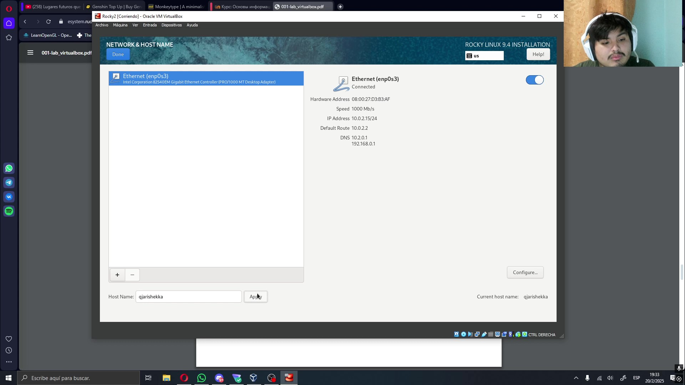

::::::::::::::

## настройка пароля

:::::::::::::: {.columns align=center}

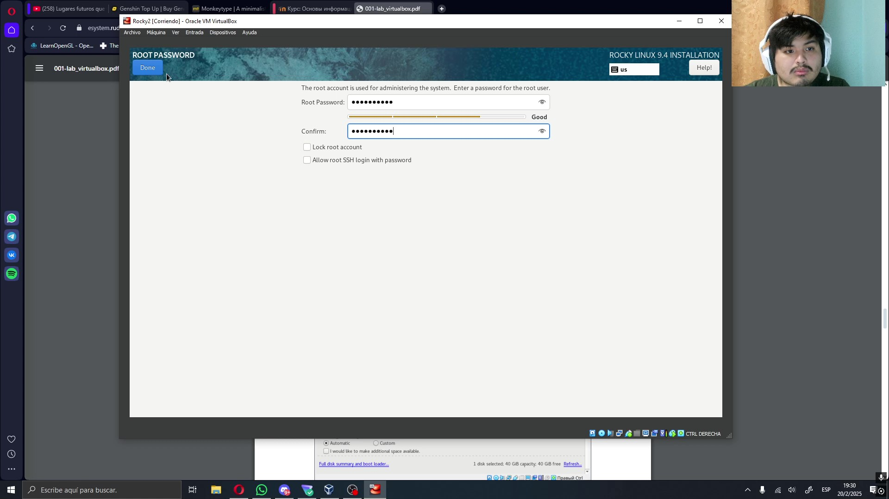

::::::::::::::

## настройка пользователя

:::::::::::::: {.columns align=center}

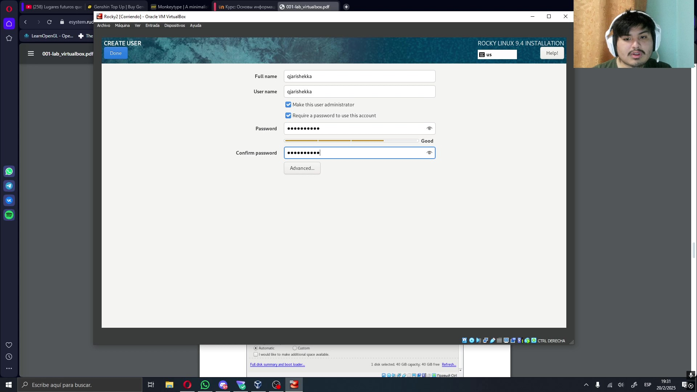

::::::::::::::

## начало установки

:::::::::::::: {.columns align=center}

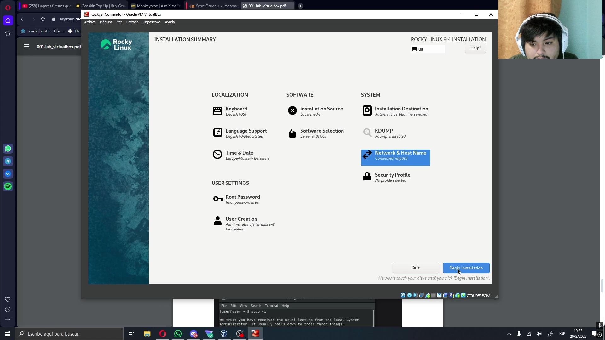

::::::::::::::

## перезагрузка системы

:::::::::::::: {.columns align=center}

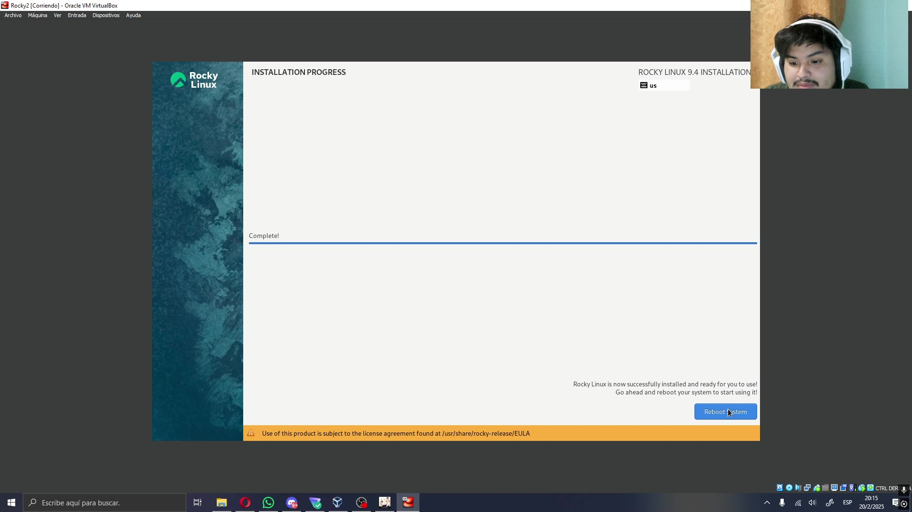

::::::::::::::

# терминал, VMB и основная информация системы

## установка плагинов VMB

:::::::::::::: {.columns align=center}

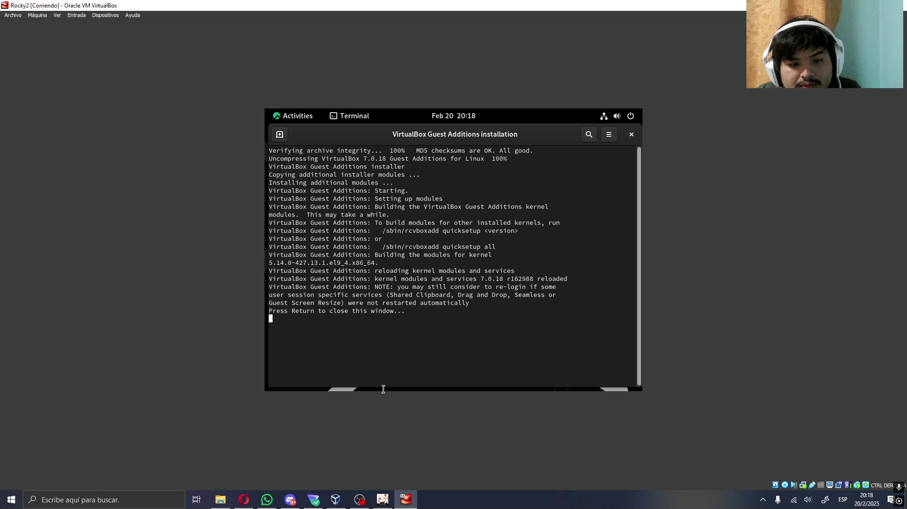

::::::::::::::

## версия linux

:::::::::::::: {.columns align=center}

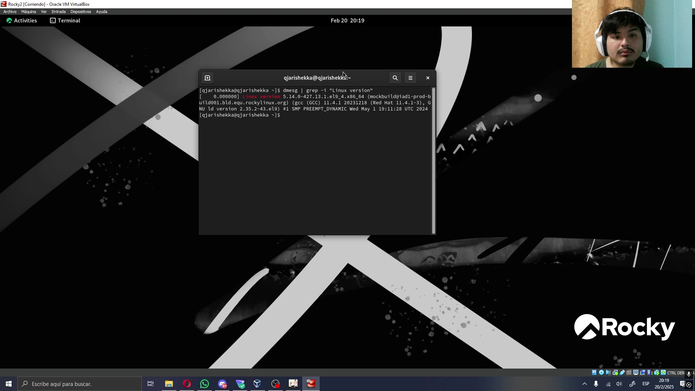

::::::::::::::

## MHZ процессора

:::::::::::::: {.columns align=center}

::::::::::::::

## тип процессора

:::::::::::::: {.columns align=center}

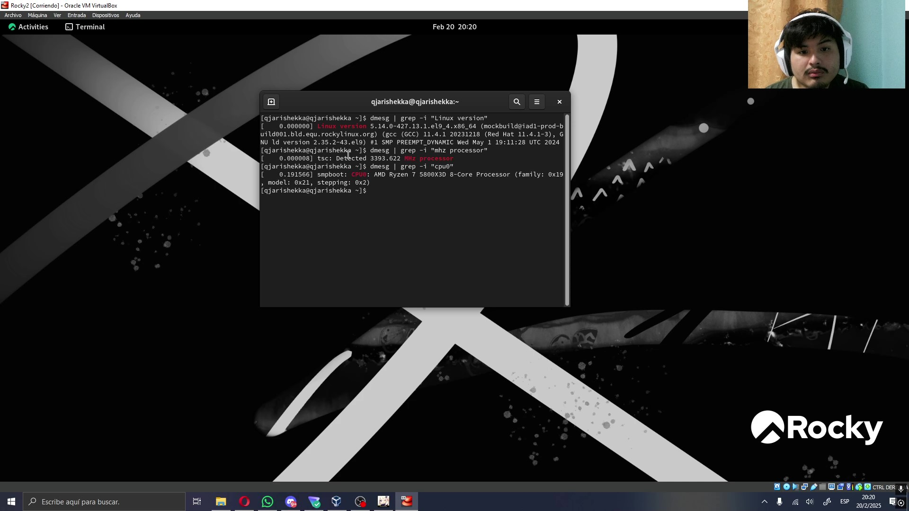

::::::::::::::

## сбоводная оперативная память

:::::::::::::: {.columns align=center}

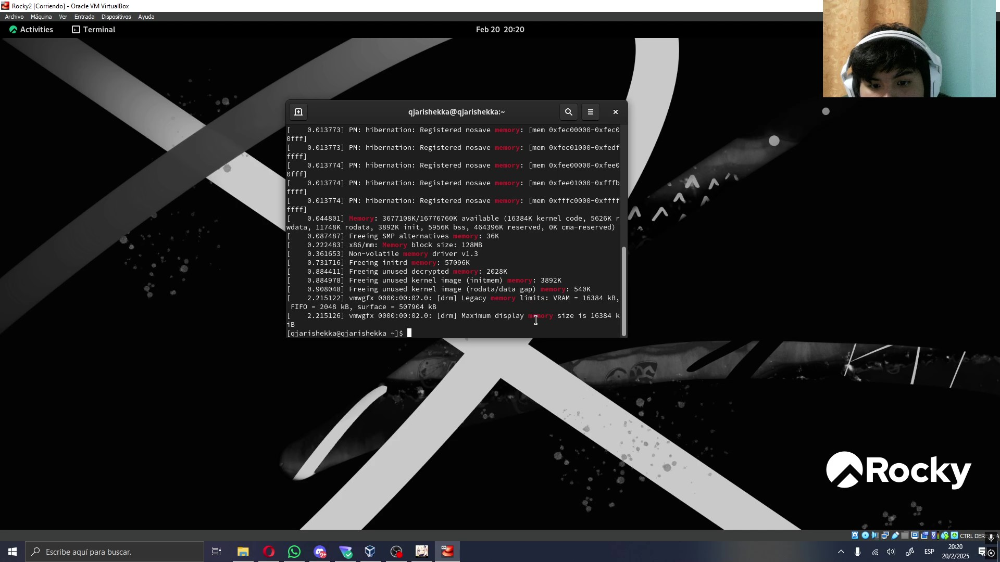

::::::::::::::

## Hypervisor

:::::::::::::: {.columns align=center}

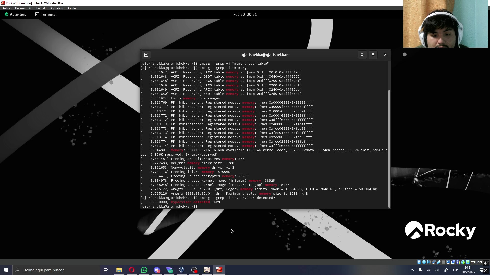

::::::::::::::

## filesystem

:::::::::::::: {.columns align=center}

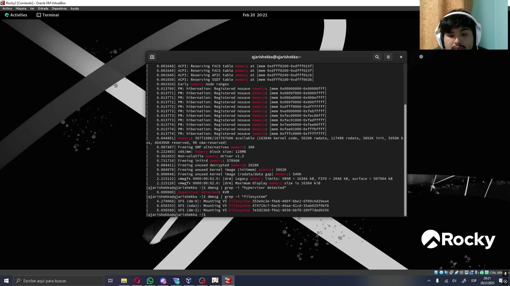

::::::::::::::

