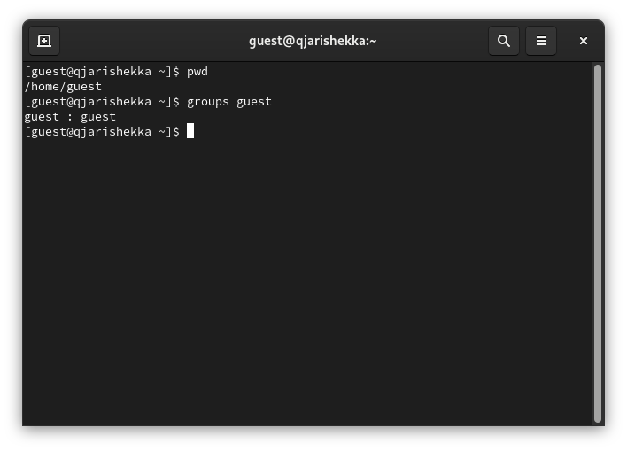
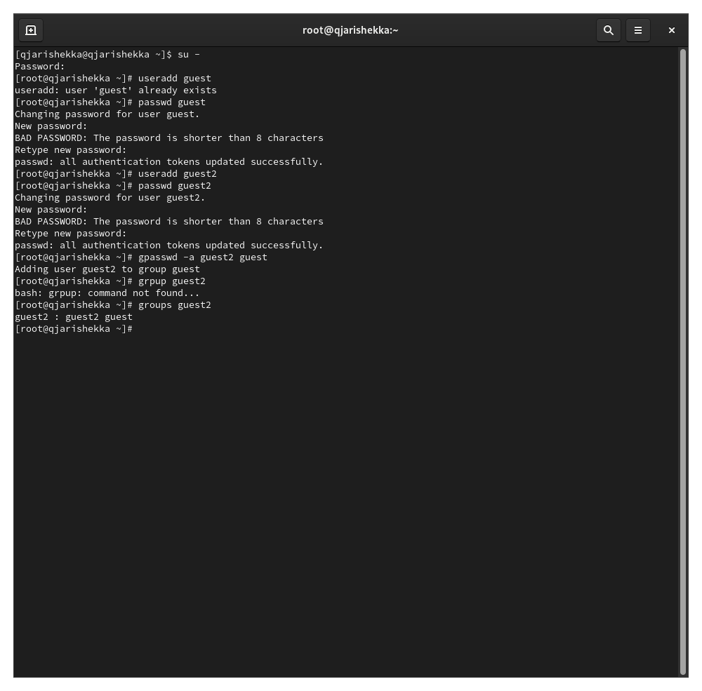
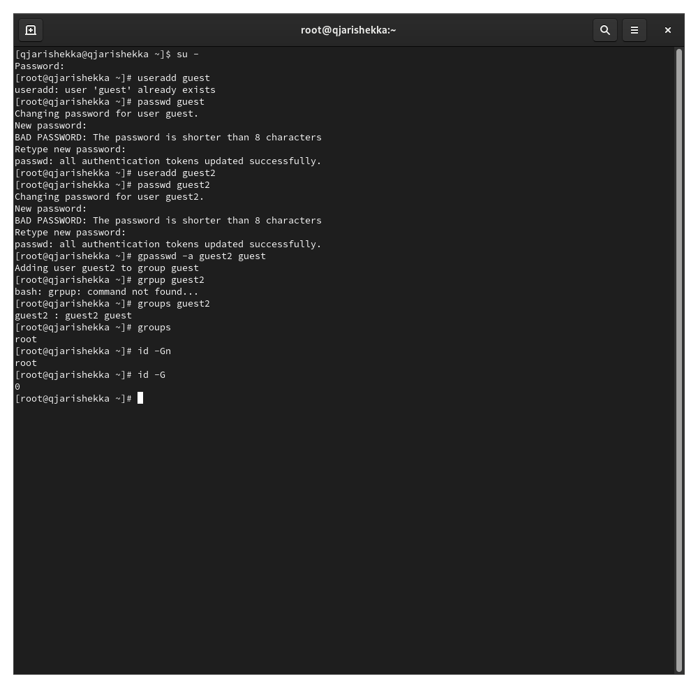
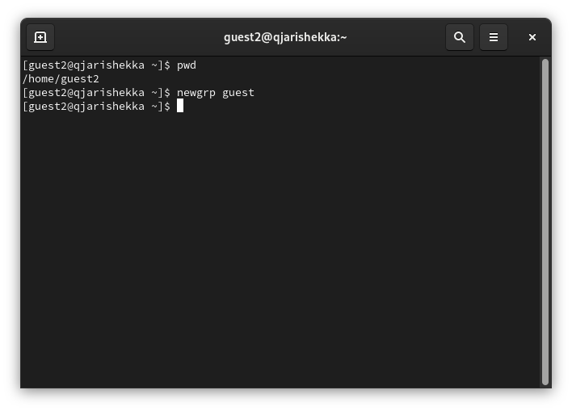
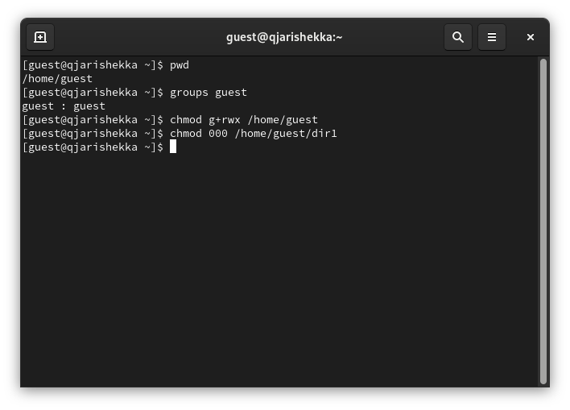
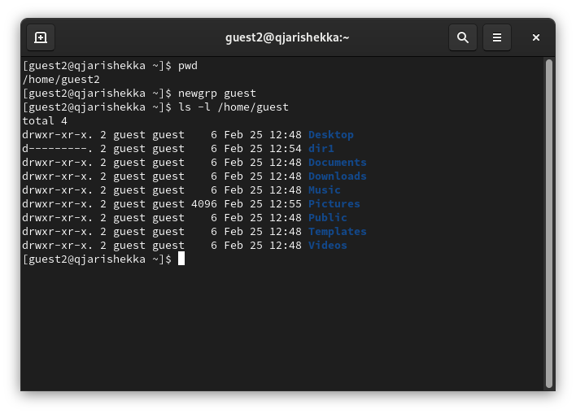

---
## Front matter
lang: ru-RU
title: презентация лабораторной работы №3
subtitle: Дискреционное разграничение прав в Linux
author:
  - Кхари Жекка Кализая Арсе

## i18n babel
babel-lang: russian
babel-otherlangs: english

## Formatting pdf
toc: false
toc-title: Содержание
slide_level: 2
aspectratio: 169
section-titles: true
theme: metropolis
header-includes:
 - \metroset{progressbar=frametitle,sectionpage=progressbar,numbering=fraction}
---

# Порядок выполнения работы

## Создание Пользователей

:::::::::::::: {.columns align=center}
::: {.column}

- Команды
  - useradd guest
  - passwd guest
  - useradd guest2
  - passwd guest2
  - gpasswd -a guest2 guest

:::

::: {.column width="80%"}

:::
::::::::::::::

## Вход в систему от двух пользователей
:::::::::::::: {.columns align=center}
::: {.column}

:::

::: {.column}

:::
::::::::::::::

## определение директорий
:::::::::::::: {.columns align=center}
::: {.column}

- команды:
   - pwd

:::

::: {.column}
- команды:
   - pwd

:::
::::::::::::::

## информация о пользователях
:::::::::::::: {.columns align=center}
::: {.column}

- команды:
   - groups guest

:::

::: {.column}

- команды:
   - groups guest2

:::
::::::::::::::

## информация о пользователе Root
:::::::::::::: {.columns align=center}
::: {.column}

- команды:
   - id -Gn
   - id -G

:::

::: {.column}

:::
::::::::::::::

## Сравнение информации пользователей
:::::::::::::: {.columns align=center}
::: {.column}

- команды:
   - cat /etc/group

:::

::: {.column}

:::
::::::::::::::

## Регистрация пользователя guest2
:::::::::::::: {.columns align=center}
::: {.column}

- команды:
   - newgrp guest

:::

::: {.column}

:::
::::::::::::::

## изменение прав доступа 
:::::::::::::: {.columns align=center}
::: {.column}

- команды:
   - chmod g+rwx /home/guest

:::

::: {.column}

:::
::::::::::::::

## Снятие атрибутов
:::::::::::::: {.columns align=center}
::: {.column}

- команды:
   - chmod 000 home/guest/dir1

:::

::: {.column}

:::
::::::::::::::

## Проверка атрибутов
:::::::::::::: {.columns align=center}
::: {.column}

- команды:
   - ls -l home/guest

:::

::: {.column}

:::
::::::::::::::

