---
## Front matter
title: "отчёт по лабораторной работе №3"
subtitle: "Дискреционное разграничение прав в Linux. Два пользователя"
author: "Кхари Жекка Кализая Арсе"

## Generic otions
lang: ru-RU
toc-title: "Содержание"

## Bibliography
bibliography: bib/cite.bib
csl: pandoc/csl/gost-r-7-0-5-2008-numeric.csl

## Pdf output format
toc: true # Table of contents
toc-depth: 2
lof: true # List of figures
lot: true # List of tables
fontsize: 12pt
linestretch: 1.5
papersize: a4
documentclass: scrreprt
## I18n polyglossia
polyglossia-lang:
  name: russian
  options:
	- spelling=modern
	- babelshorthands=true
polyglossia-otherlangs:
  name: english
## I18n babel
babel-lang: russian
babel-otherlangs: english
## Fonts
mainfont: IBM Plex Serif
romanfont: IBM Plex Serif
sansfont: IBM Plex Sans
monofont: IBM Plex Mono
mathfont: STIX Two Math
mainfontoptions: Ligatures=Common,Ligatures=TeX,Scale=0.94
romanfontoptions: Ligatures=Common,Ligatures=TeX,Scale=0.94
sansfontoptions: Ligatures=Common,Ligatures=TeX,Scale=MatchLowercase,Scale=0.94
monofontoptions: Scale=MatchLowercase,Scale=0.94,FakeStretch=0.9
mathfontoptions:
## Biblatex
biblatex: true
biblio-style: "gost-numeric"
biblatexoptions:
  - parentracker=true
  - backend=biber
  - hyperref=auto
  - language=auto
  - autolang=other*
  - citestyle=gost-numeric
## Pandoc-crossref LaTeX customization
figureTitle: "Рис."
tableTitle: "Таблица"
listingTitle: "Листинг"
lofTitle: "Список иллюстраций"
lotTitle: "Список таблиц"
lolTitle: "Листинги"
## Misc options
indent: true
header-includes:
  - \usepackage{indentfirst}
  - \usepackage{float} # keep figures where there are in the text
  - \floatplacement{figure}{H} # keep figures where there are in the text
---

# Цель работы

Получение практических навыков работы в консоли с атрибутами фай-
лов для групп пользователей1.

# Задание

- Создание нового пользователя и изменение прав доступа.
- Заполнение таблицы

# Выполнение лабораторной работы

Сначала я запустил терминал и выполнил команду для создания нового пользователя guest  (рис. [-@fig:001		]).

		useradd guest

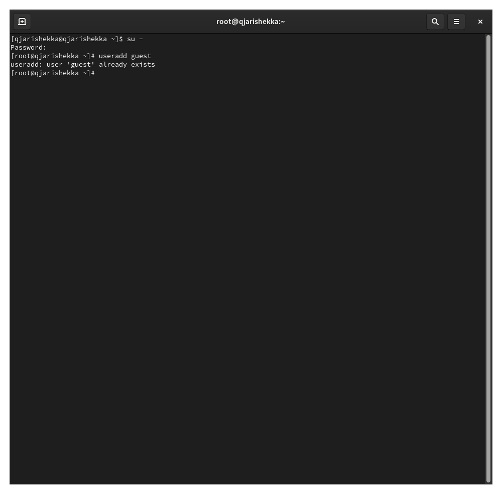{#fig:001 		width=70%}

Потом я изменил пароль пользователя, я дал 1234 паролем(рис. [-@fig:002		]).

		passwd 
		1234
		1234

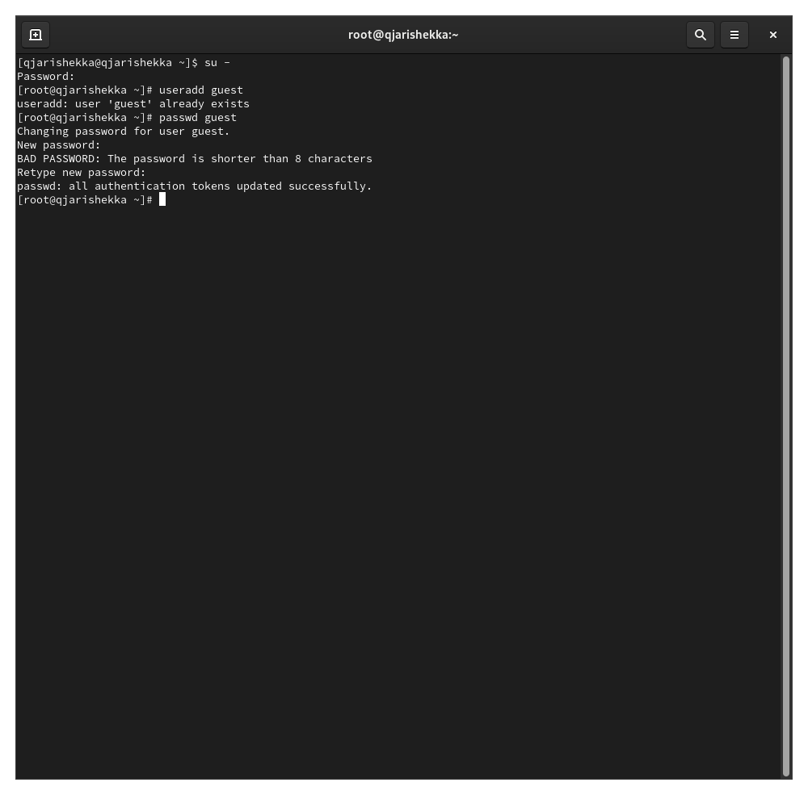{#fig:002 		width=70%}

Дальше я повторил шаги 1 2 чтобы создать еще раз нового пользователя (рис. [-@fig:003		]).

		useradd guest2
		passwd 
		1234
		1234

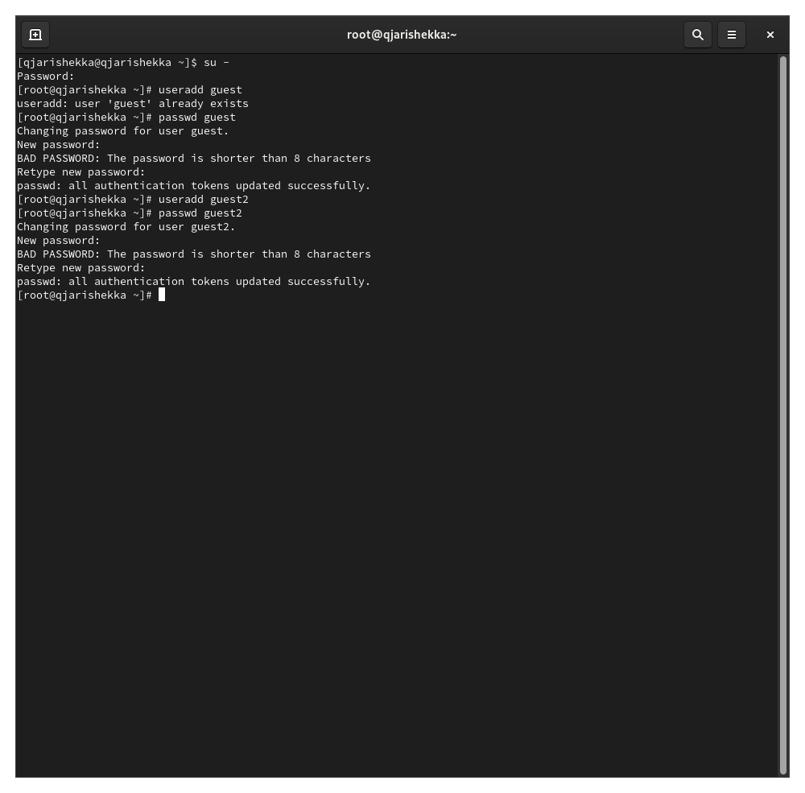{#fig:003 		width=70%}

Потом я добавил пользователя guest2 в группу guest (рис. [-@fig:004		]).

		gpasswd -a guest2 guest

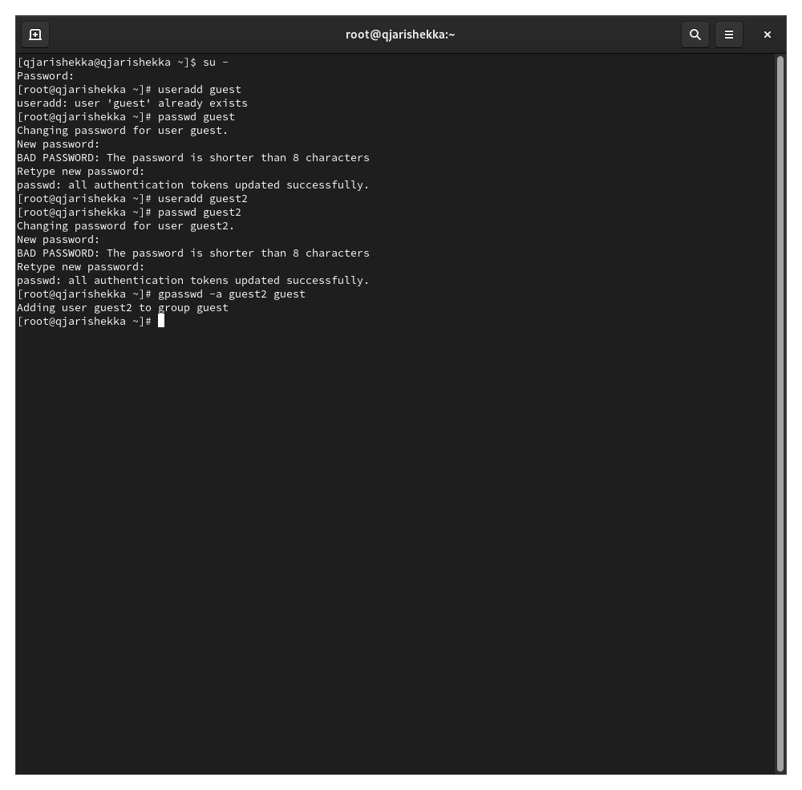{#fig:004 		width=70%}

Затем я вошел в систему от двух пользователей на двух разных консолях рис. [-@fig:005		] и рис. [-@fig:006		].

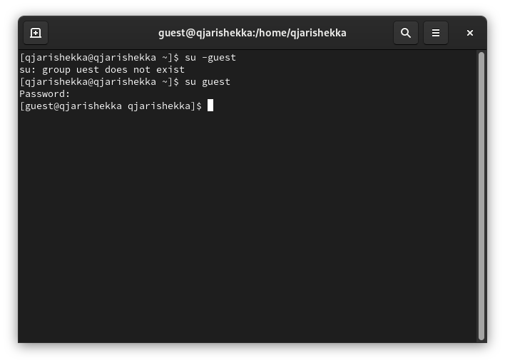{#fig:005 		width=70%}

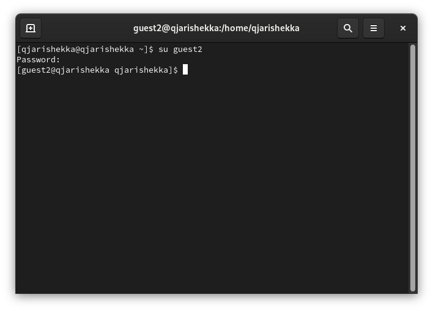{#fig:006 		width=70%}

Потом я выполнил команду pwd чтобы определить директории в которых находился по каждому терминалу рис. [-@fig:007		] и рис. [-@fig:008		].

		pwd
		pwd

{#fig:007 		width=70%}

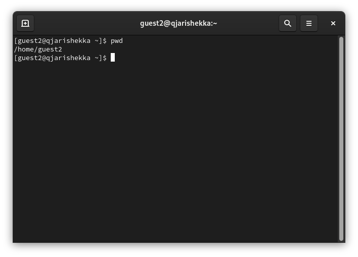{#fig:008 		width=70%}

я отметил что директории разные, это бывает потому что у разных пользователей есть разные каталоги, которые они контролируют.

Потом я уточнил информацию о пользователях  от рис. [-@fig:009		] до рис. [-@fig:013		].

		groups guest
		groups guest2
		groups
		id -Gn
		id -G

{#fig:009 		width=70%}

{#fig:010 		width=70%}

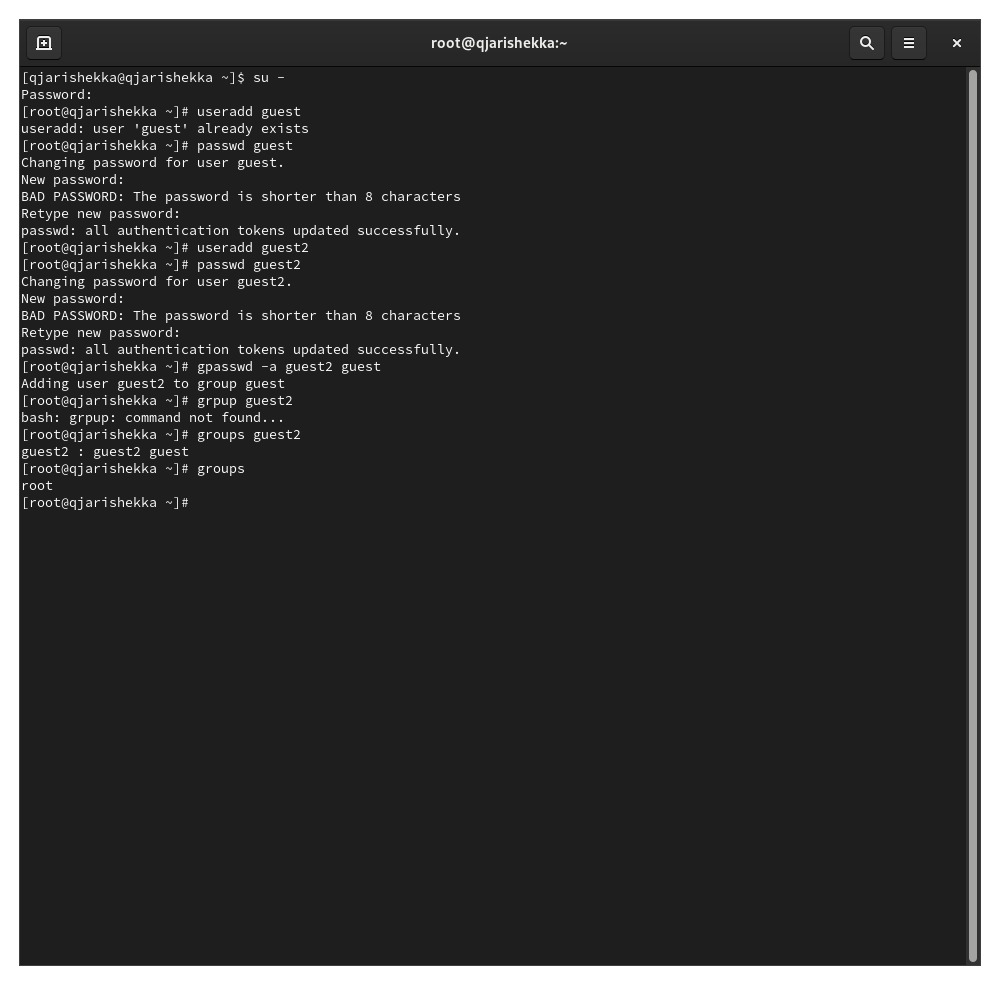{#fig:011 		width=70%}

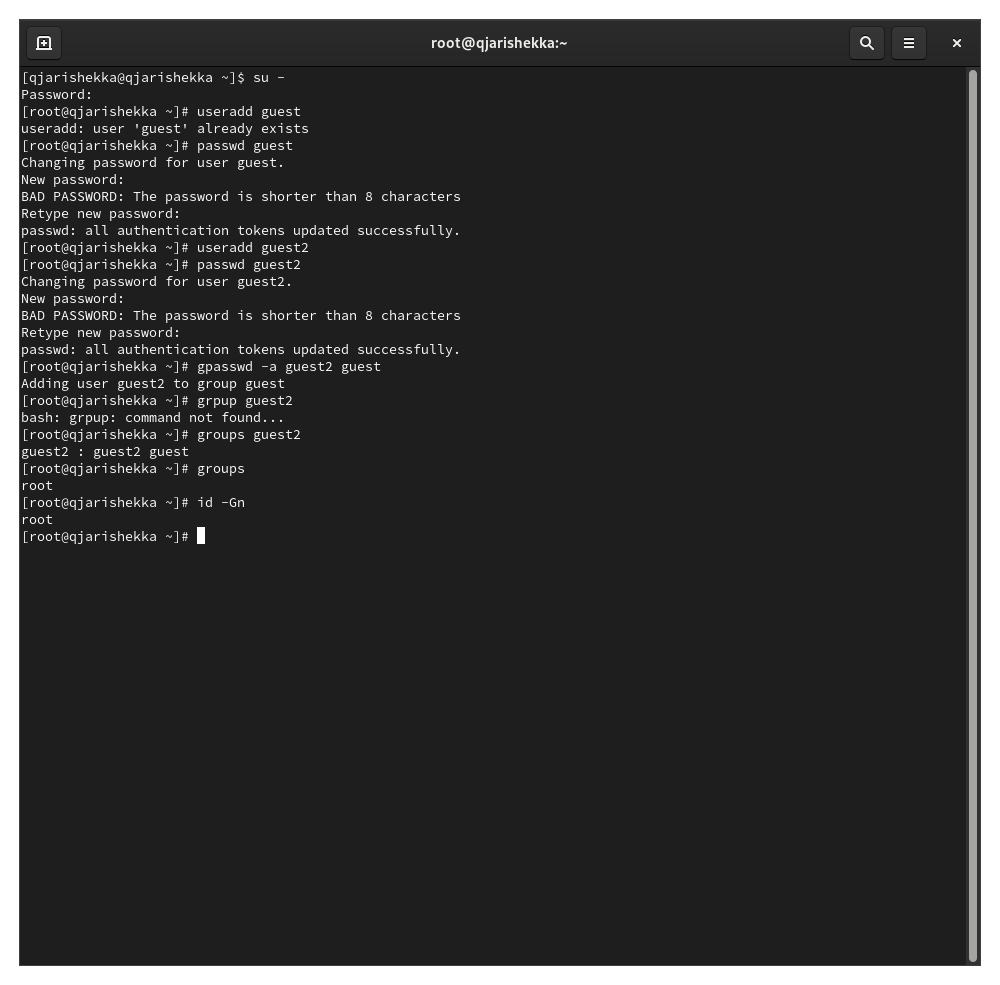{#fig:012 		width=70%}

{#fig:013 		width=70%}

Дальше я сравнил информацию с содержимым файла /etc/group (рис. [-@fig:014		]).

		cat /etc/group
		

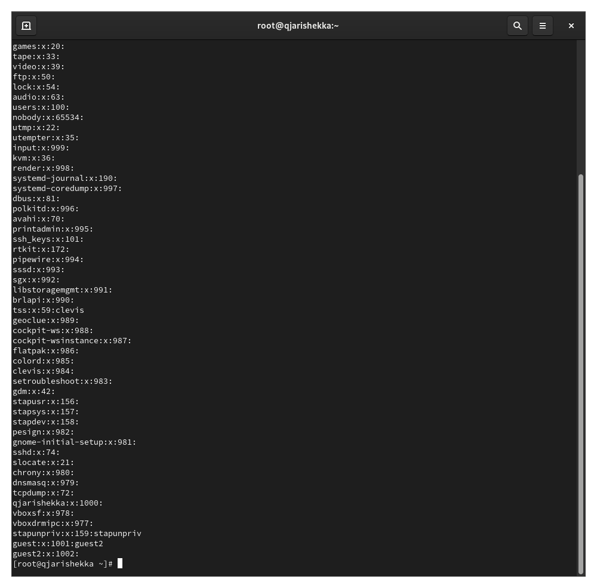{#fig:014 		width=70%} 

Потом изпользуя терминал guest2 я выполнил команду для регистрации пользователя guest2 в группе guest  (рис. [-@fig:016		]).

{#fig:016 		width=70%}

дальше я изменил права директории /home/guest изпользуя терминал guest (рис. [-@fig:017		]).

		chmod g+rwx /home/guest

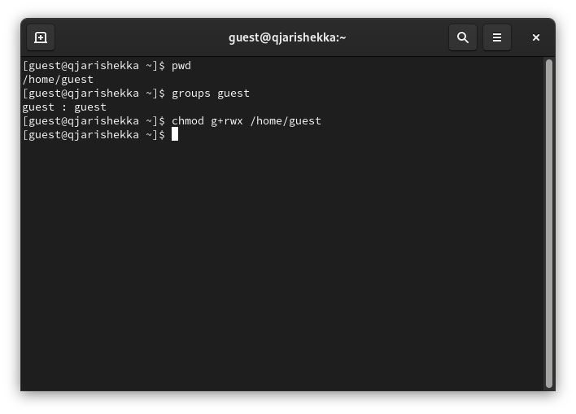{#fig:017 		width=70%}

Потом я снял все атрибуты с той же директории (рис. [-@fig:018		]).

{#fig:018 		width=70%}

Потом я проверил правильность снятия атрибутов (рис. [-@fig:020		]).

{#fig:020 		width=70%}

# Выводы

В эту лабораторную работу я смог впоминать команды для создания нового пользователя, для регистрации новой группы и также смог уточнить какие действия пользователи могут выполнить над каталогом без прав доступ

# Список литературы{.unnumbered}

::: {#refs}
:::
