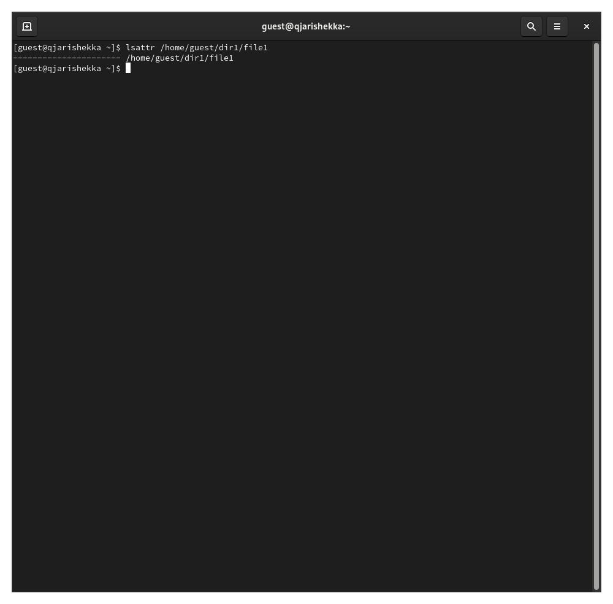
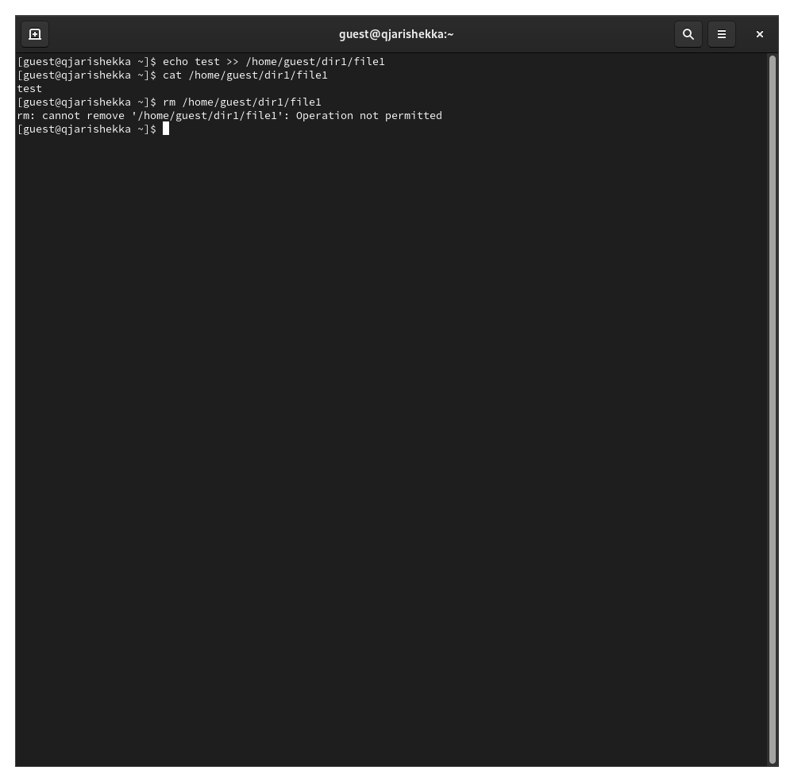
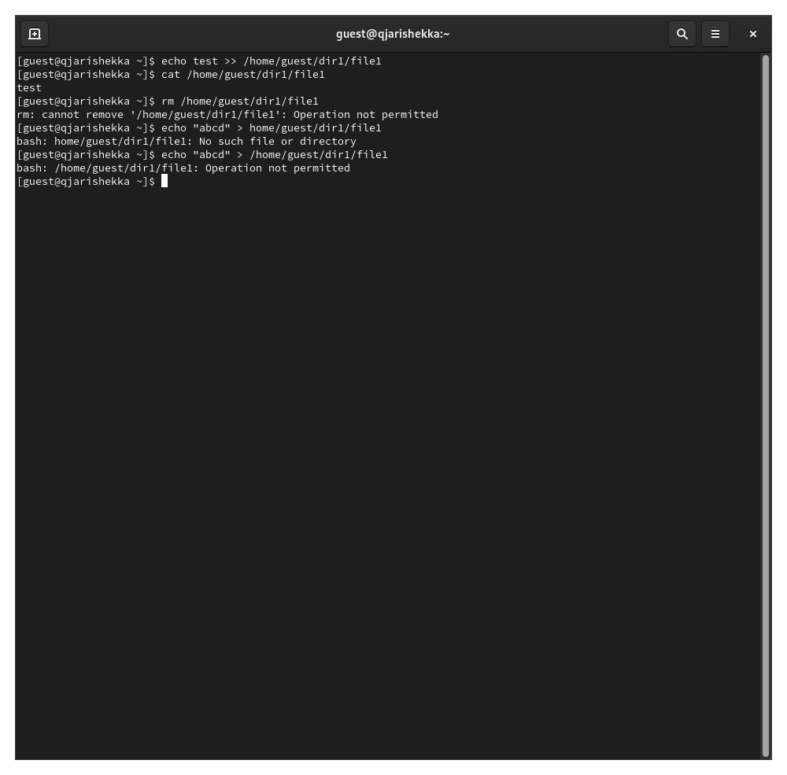
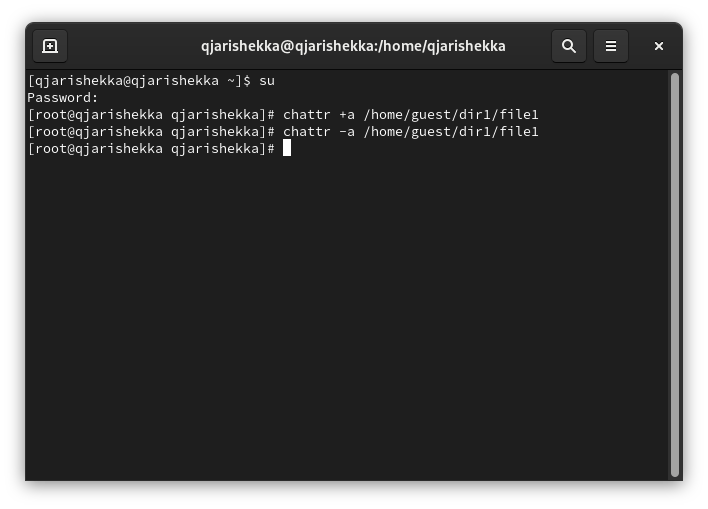
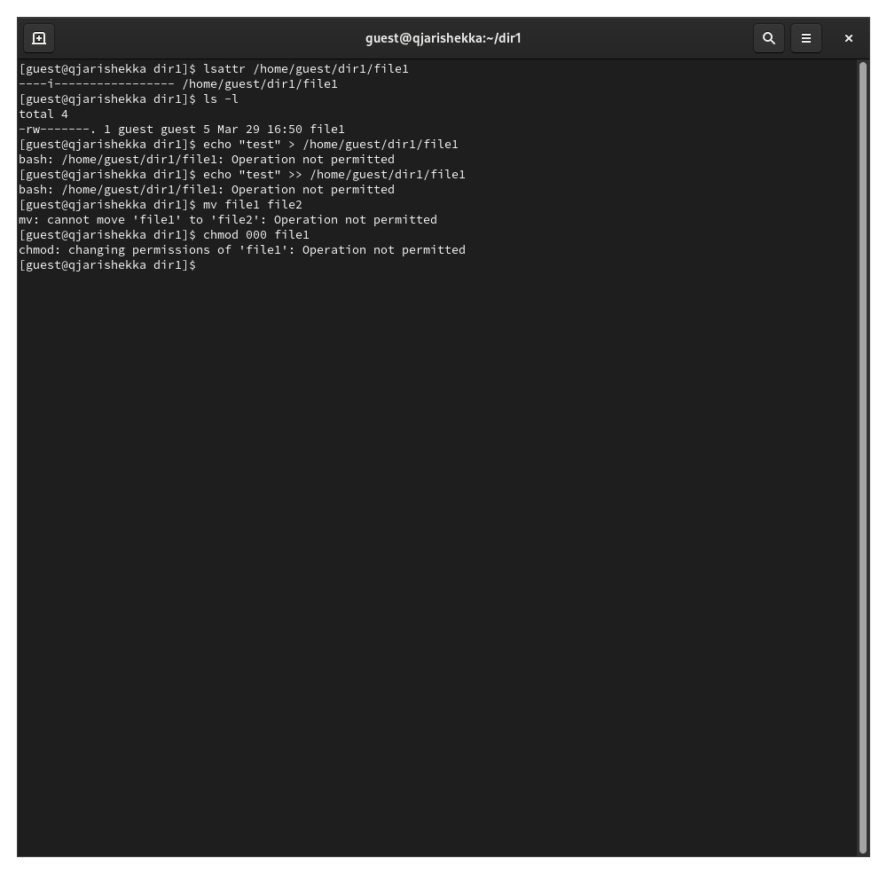

---
## Front matter
lang: ru-RU
title: презентация лабораторной работы №4
subtitle: Дискреционное разграничение прав в Linux. Расширенные атрибуты
author:
  - Кхари Жекка Кализая Арсе

## i18n babel
babel-lang: russian
babel-otherlangs: english

## Formatting pdf
toc: false
toc-title: Содержание
slide_level: 2
aspectratio: 169
section-titles: true
theme: metropolis
header-includes:
 - \metroset{progressbar=frametitle,sectionpage=progressbar,numbering=fraction}
---

# выполнение лабораторной работы

## определение расширенных атрибутов

:::::::::::::: {.columns align=center}
::: {.column width="70%"}

- команды:
	- lsattr /home/guest/dir1/file1

:::
::: {.column width="30%"}

:::
::::::::::::::

## установка расширенных атрибутов

:::::::::::::: {.columns align=center}
::: {.column width="70%"}

- команды:
	- chmod 600 file1
	- chattr +a /home/guest/dir1/file1

:::
::: {.column width="30%"}

:::
::::::::::::::

## установка расширенных атрибутов от суперпользователя

:::::::::::::: {.columns align=center}
::: {.column width="70%"}

- команды:

	- chattr +a /home/guest/dir1/file1

:::
::: {.column width="30%"}

:::
::::::::::::::

## проверка правильности установления атрибута

:::::::::::::: {.columns align=center}
::: {.column width="70%"}

- команды:

	- lsattr /home/dir1/file1

:::
::: {.column width="30%"}

:::
::::::::::::::

## действия над файлом file1

## дозапись 

:::::::::::::: {.columns align=center}
::: {.column width="70%"}

- команды:

	- echo "test" >> /home/guest/dir1/file1

:::
::: {.column width="30%"}

:::
::::::::::::::

## удаление 

:::::::::::::: {.columns align=center}
::: {.column width="70%"}

- команды:

	- rm file1

:::
::: {.column width="30%"}

:::
::::::::::::::

## стереть имеющуюся в нём информацию 

:::::::::::::: {.columns align=center}
::: {.column width="70%"}

- команды:

	- echo "abcd" > /home/guest/dir1/file1

:::
::: {.column width="30%"}

:::
::::::::::::::

## переименование

:::::::::::::: {.columns align=center}
::: {.column width="70%"}

- команды:

	- mv file1 file2

:::
::: {.column width="30%"}

:::
::::::::::::::

## Снятие прав доступа

:::::::::::::: {.columns align=center}
::: {.column width="70%"}

- команды:

	- chmod 000 file1

:::
::: {.column width="30%"}

:::
::::::::::::::

## снятие раширенных атрибутов с файла file1

:::::::::::::: {.columns align=center}
::: {.column width="70%"}

- команды:

	- chattr -a /home/guest/dir1/file1

:::
::: {.column width="30%"}

:::
::::::::::::::

## вторая попытка снятия прав доступа

:::::::::::::: {.columns align=center}
::: {.column width="70%"}

- команды:

	- chmod 000 file1

:::
::: {.column width="30%"}

:::
::::::::::::::

# повторение шагов используя расширенный атрибут i

## изменение прав доступа

:::::::::::::: {.columns align=center}
::: {.column width="70%"}

- команды:

	- chmod 000 file1

:::
::: {.column width="30%"}

:::
::::::::::::::

## установка расширенных атрибутов от суперпользователя

:::::::::::::: {.columns align=center}
::: {.column width="70%"}

- команды:

	- chattr +a /home/guest/dir1/file1

:::
::: {.column width="30%"}

:::
::::::::::::::

## проверка правильности установления атрибута

:::::::::::::: {.columns align=center}
::: {.column width="70%"}

- команды:

	- lsattr /home/dir1/file1

:::
::: {.column width="30%"}

:::
::::::::::::::

## действия над файлом file1

## дозапись 

:::::::::::::: {.columns align=center}
::: {.column width="70%"}

- команды:

	- echo "test" >> /home/guest/dir1/file1

:::
::: {.column width="30%"}

:::
::::::::::::::

## стереть имеющуюся в нём информацию 

:::::::::::::: {.columns align=center}
::: {.column width="70%"}

- команды:

	- echo "abcd" > /home/guest/dir1/file1

:::
::: {.column width="30%"}

:::
::::::::::::::

## переименование

:::::::::::::: {.columns align=center}
::: {.column width="70%"}

- команды:

	- mv file1 file2

:::
::: {.column width="30%"}

:::
::::::::::::::

## Снятие прав доступа

:::::::::::::: {.columns align=center}
::: {.column width="70%"}

- команды:

	- chmod 000 file1

:::
::: {.column width="30%"}

:::
::::::::::::::

## снятие раширенных атрибутов с файла file1

:::::::::::::: {.columns align=center}
::: {.column width="70%"}

- команды:

	- chattr -a /home/guest/dir1/file1

:::
::: {.column width="30%"}

:::
::::::::::::::

## вторая попытка снятия прав доступа

:::::::::::::: {.columns align=center}
::: {.column width="70%"}

- команды:

	- chmod 000 file1

:::
::: {.column width="30%"}

:::
::::::::::::::

# Спасибо за внимание

