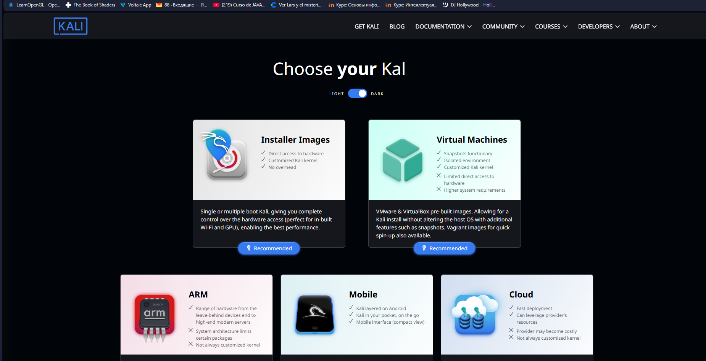
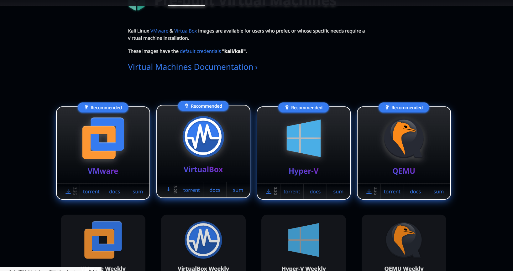
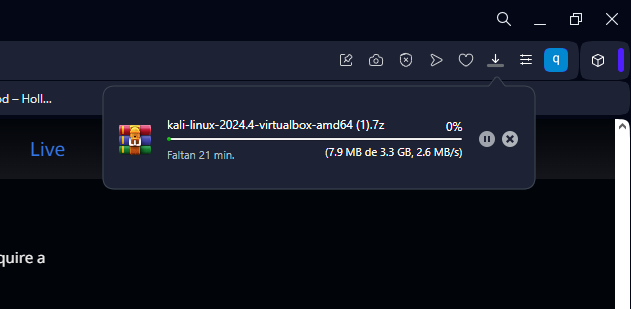
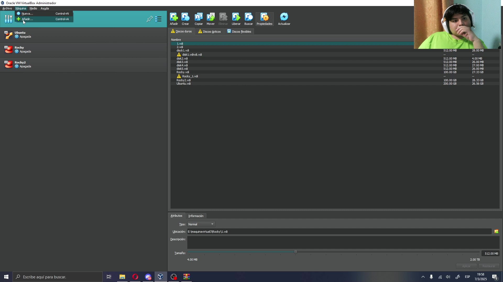
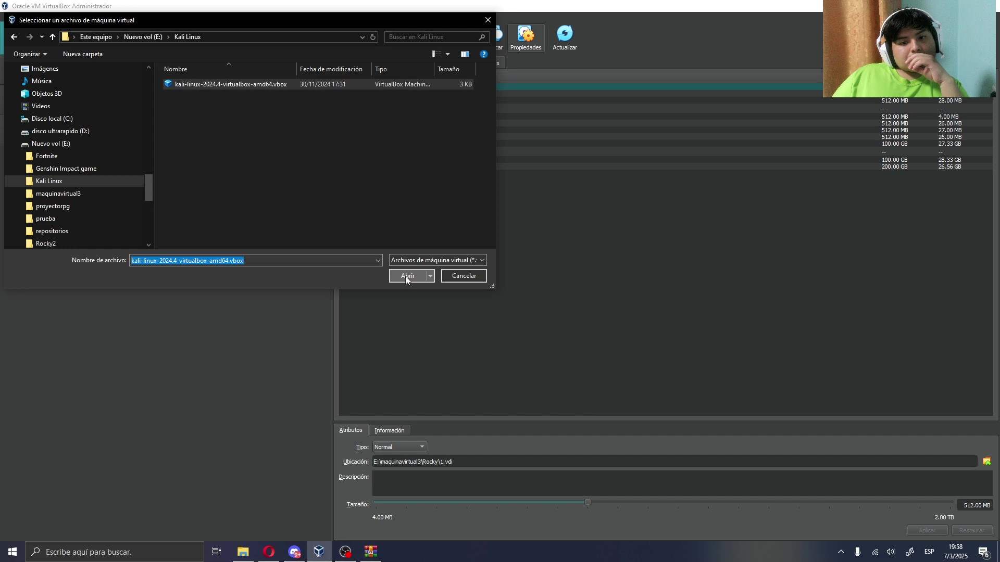
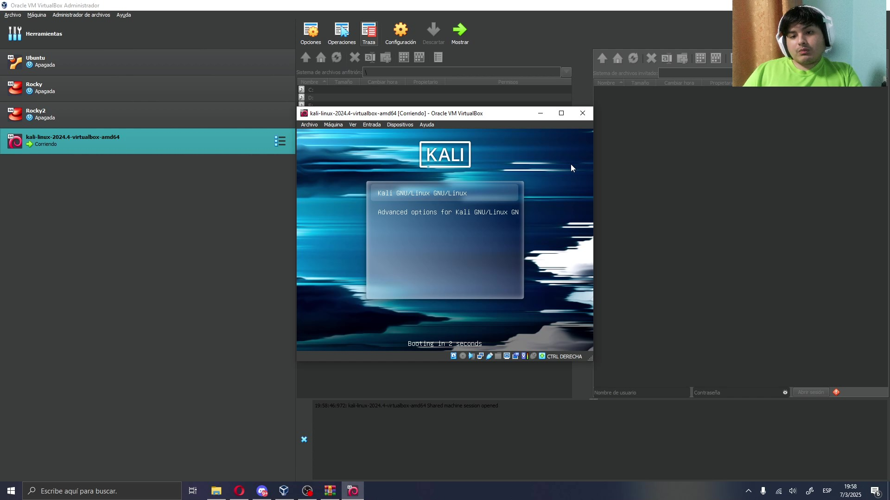
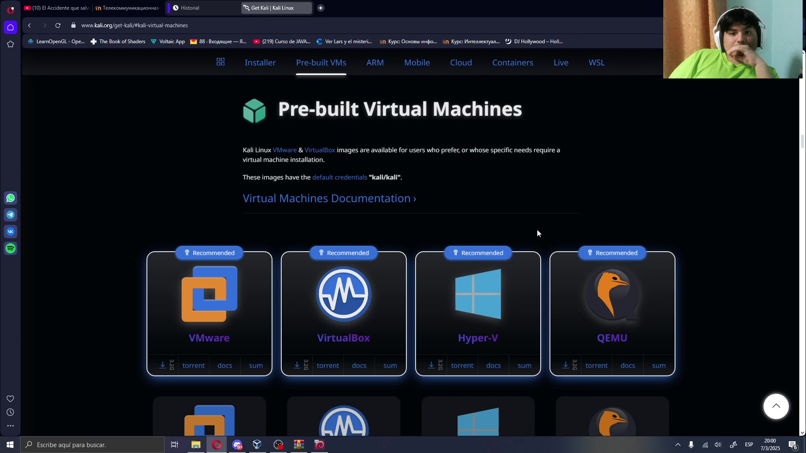
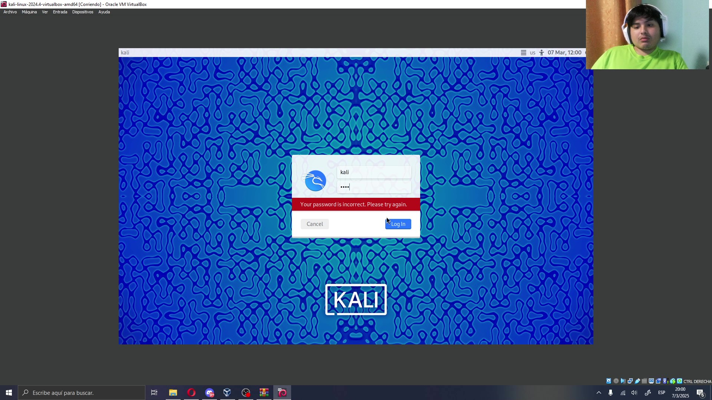
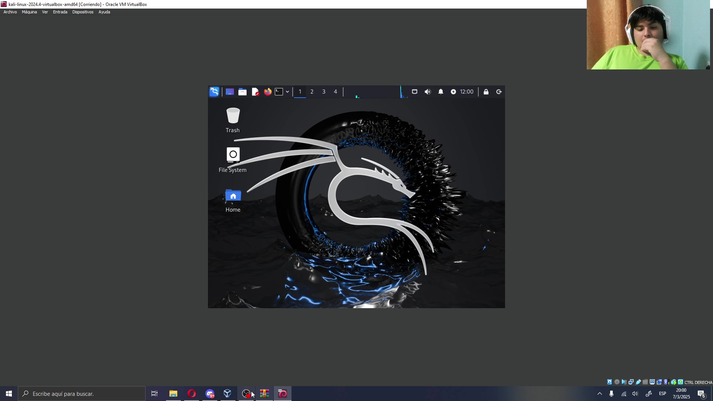

---
## Front matter
title: "Отчет проекта"
subtitle: "установка kali linux"
author: "Кхари Жекка Кализая Арсе"

## Generic otions
lang: ru-RU
toc-title: "Содержание"

## Bibliography
bibliography: bib/cite.bib
csl: pandoc/csl/gost-r-7-0-5-2008-numeric.csl

## Pdf output format
toc: true # Table of contents
toc-depth: 2
lof: true # List of figures
lot: true # List of tables
fontsize: 12pt
linestretch: 1.5
papersize: a4
documentclass: scrreprt
## I18n polyglossia
polyglossia-lang:
  name: russian
  options:
	- spelling=modern
	- babelshorthands=true
polyglossia-otherlangs:
  name: english
## I18n babel
babel-lang: russian
babel-otherlangs: english
## Fonts
mainfont: IBM Plex Serif
romanfont: IBM Plex Serif
sansfont: IBM Plex Sans
monofont: IBM Plex Mono
mathfont: STIX Two Math
mainfontoptions: Ligatures=Common,Ligatures=TeX,Scale=0.94
romanfontoptions: Ligatures=Common,Ligatures=TeX,Scale=0.94
sansfontoptions: Ligatures=Common,Ligatures=TeX,Scale=MatchLowercase,Scale=0.94
monofontoptions: Scale=MatchLowercase,Scale=0.94,FakeStretch=0.9
mathfontoptions:
## Biblatex
biblatex: true
biblio-style: "gost-numeric"
biblatexoptions:
  - parentracker=true
  - backend=biber
  - hyperref=auto
  - language=auto
  - autolang=other*
  - citestyle=gost-numeric
## Pandoc-crossref LaTeX customization
figureTitle: "Рис."
tableTitle: "Таблица"
listingTitle: "Листинг"
lofTitle: "Список иллюстраций"
lotTitle: "Список таблиц"
lolTitle: "Листинги"
## Misc options
indent: true
header-includes:
  - \usepackage{indentfirst}
  - \usepackage{float} # keep figures where there are in the text
  - \floatplacement{figure}{H} # keep figures where there are in the text
---

# Цель работы

Установить ОС Kali Linux в виртуальной машине

# Выполнение лабораторной работы

Сначала я искаль и скачал файл виртуальной машины из сайта Kali linux  (рис. [-@fig:001		] до рис. [-@fig:003]).

{#fig:001 		width=70%}

{#fig:002		width=70%}

{#fig:003 		width=70%}

Потом я запутил Virtual Box и добавил новую машину (рис. [-@fig:004		]).

{#fig:004 		width=70%}

Потом из скачанного архива я выбрал файл kali-linux-2024.4-virtualbox-amd64.vbox (рис. [-@fig:005		]).

{#fig:005 		width=70%}

Потом я запустил её и выбрал первую опцию чтобы загрузить ОС (рис. [-@fig:006		]).

{#fig:006 		width=70%}

Потом в сайте Kali linux я искал Учётные данные по умолчанию, в моей случае были kali/kali, тогда я ввел эти данные при запуске (рис. [-@fig:007		]) до (рис. [-@fig:009		]).

{#fig:007		width=70%}

{#fig:008 		width=70%}

{#fig:009 		width=70%}

# Выводы

В этую лабораторную работу я смог установить kali linux в VB из специального файла скачанного от сайта Kali linux

# Список литературы{.unnumbered}

::: {#refs}
:::
